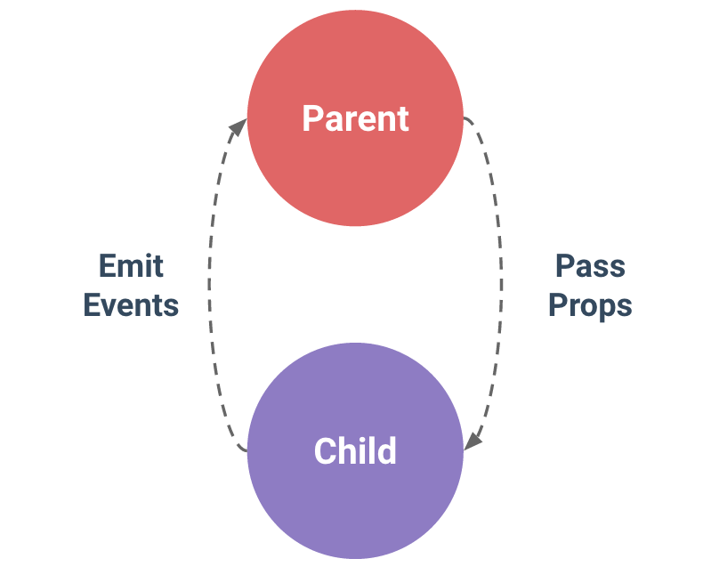

# Vue.js

## Vue.js가 무엇인가?
- 사용자 인터페이스를 만들기 위한 프로그레시브 프레임워크

## Javascript Framework를 왜 쓸까?
- 편리한 데이터 바인딩과 상태 관리
- 빠른 개발, 쉬운 유지보수
- SPA

## SPA
- Single Page Application

## Vue.js를 쓰는 이유?
- 사용자 경험
    - 페이지(리프레쉬) -> 앱(필요한 부분만 렌더링)
    - 반응성 향상
    - 풍부한 기능
- 코드 분리
    - 서버 & 브라우저
- 배포의 이점

## Vue.js 설치방법
- [Vue.js 설치 방법](https://kr.vuejs.org/v2/guide/installation.html)

## 컴포넌트(Component) Based

<br/>
HTML 엘리먼트를 확장하여 재사용 가능한 코드를 캡슐화 하는데 도움이 됨. 상위 수준에서 컴포넌트는 Vue의 컴파일러에 의해 동작이 추가된 사용자 지정 엘리먼트임. 경우에 따라 특별한 <code>is</code>속성으로 확장된 원시 HTML 엘리먼트로 나타날 수 있음`
<br/>
Vue 컴포넌트는 Vue 인스턴스이기도함. 모든 옵션 객체를 사용할 수 있음. (루트에만 사용하는 옵션은 제외함) 같은 라이프사이클 훅을 사용할 수 있음
  
## 컴포넌트 사용하기

### 전역등록
```javascript
new Vue({
    el: '#some-element',
    // 옵션
})
```
전역 컴포넌트를 등록하려면, <code>Vue.component(tagName, options)</code>를 사용함
```javascript
Vue.component('my-component', {
    //옵션
})
```
모두 소문자, 하이픈을 포함하는 규칙을 따르는 것이 좋음<br/>
일단 등록되면, 컴포넌트는 인스턴스의 템플릿에서 커스텀 엘리먼트 `<my-component></my-component>`로 사용할 수 있음. 루트 Vue인스턴스를 인스턴스화 하기 **전에** 컴포넌트가 등록되어 있는지 확인해야함
```html
<div id="example">
    <my-component></my-component>
</div>
```
```javascript
//등록
Vue.component('my-component',{
    template: '<div>사용자 정의 컴포넌트 입니다!</div>'
})

//루트 인스턴스 생성
new Vue({
    el: '#example'
})
```
아래와 같이 렌더링 됨
```html
<div id="example">
    <div>사용자 정의 컴포넌트 입니다!</div>
</div>
```

### 지역등록
모든 컴포넌트를 전역으로 등록할 필요 없음. 컴포넌트를 <code>components</code> 인스턴스 옵션으로 등록함으로써 다른 인스턴스/컴포넌트의 범위에서만 사용할 수 있는 컴포넌트를 만들 수 있음
```javascript
var Child = {
    template: '<div>사용자 정의 컴포넌트 입니다!</div>'
}

new Vue({
    //...
    components: {
        // <my-coponent> 는 상위 템플릿에서만 사용할 수 있음
        'my-component':Child
    }
})
```
동일한 캡슐화는 디렉트와 같은 다른 등록 가능한 Vue 기능에도 적용됨

### DOM 템플릿 구문 분석 경고
DOM을 템플릿으로 사용할 때(예: `el` 옵션을 사용하여 기존 콘텐츠가 있는 엘리먼트를 마운트 하는 경우), Vue는 템플릿 콘텐츠만 가져올 수 있기 때문에 HTML이 작동하는 방식에 고유한 몇가지 제한사항이 적용됨. 브라우저가 구문 분석과 정규화 한 후에도 작동함. 가장 중요한 것은 `<ul>`,`<ol>`,`<table>`과`<select>`와 같은 일부 엘리먼트는 그 안에 어떤 엘리먼트가 나타나는지 제한을 가지고 있고, `<option>`과 같이 특정 다른 엘리먼트 안에만 나타날 수 있음
<br/>
이러한 제한이 있는 엘리먼트가 있는 사용자 지정 컴포넌트를 사용하면 다음과 같은 문제가 발생

```html
<table>
    <my-row>...</my-row>
<table>
```
사용자 지정 컴포넌트 `<my-row>`는 잘못 된 컨텐츠가 되어, 결과적으로 렌더링시 에러를 발생. 해결 방법은 <code>is</code> 특수 속성을 사용하는 것
```html
<table>
    <tr is="my-row"></tr>
</table>
```
**다음 소스 중 하나에 포함되면 문자열 템플릿을 사용하는 경우에는 이러한 제한 사항이 적용되지 않음**
- <code><script type="text/x-template"></code>
- JavaScript 인라인 템플릿 문자열
- .vue 컴포넌트
따라서 가능한 경우 항상 문자열 템플릿을 사용하는 것이 좋음

### <code>data</code>는 반드시 함수여야 한다
vue생성자에 사용할 수 있는 대부분의 옵션은 컴포넌트에서 사용할 수 있음. 한가지 특별한 경우가 있는데 <code>data</code>는 함수여야 함. 실제로 이를 사용하는 경우의 예는
```javascript
Vue.component('my-component',{
    template:'<span>{{ message }}</span>',
    data:{
        message:'hello'
    }
})
```
그런 다음 Vue는 중단하고 콘솔에서 경고를 함. <code>data</code>는 컴포넌트 인스턴스의 함수여야함. 규칙이 존재하는 이유를 이해하는 것이 좋음. 따라서 다음과 같이 사용해야함
```html
<div id="example-2">
    <simple-counter></simple-counter>
    <simple-counter></simple-counter>
    <simple-counter></simple-counter>
</div>
```
```javascript
var data = { counter: 0 }

Vue.component('simple-counter', {
    template:'<button v-on:click="counter +=1">{{ counter }}</button>',
    //데이터는 기술적으로 함수이므로 Vue는 따지지 않지만
    //각 컴포넌트 인스턴스에 대해 같은 객체 참조를 반환
    data: function() {
        return data
    }
})

new Vue({
    el:'#example-2'
})
```
이렇게 작성하게 되면 세개의 컴포넌트 인스턴스가 모두 같은 <code>data</code> 객체를 공유하므로 하나의 카운터를 증가시키면 세개가 모두 증가함. 대신 새로운 데이터 객체를 반환하면 이 문제를 해결가능
```javascript
data : function(){
    reutrn{
        counter: 0
    }
}
```
이제 모든 카운터에는 각각 고유한 내부 상태가 있음

### 컴포넌트 작성
컴포넌트는 부모-자식 관계에서 가장 일반적으로 함께 사용하기 위한 것.
컴포넌트 A는 자체 템플릿에서 컴포넌트 B를 사용할 수 있음. 그들은 필연적으로 서로 의사소통을함.
부모는 자식에게 데이터를 전달해야 할 수 있으며, 자식은 자신에게 일어난 일을 부모에게 알릴 필요가 있음. 그러나 부모와 자식이 명확하게 정의된 인터페이스를 통해 가능한한 분리된 상태로 유지하는 것도 매우 중요함.
이처럼 각 컴포넌트의 코드를 상대적으로 격리할 수 있도록 작성하고 추론할 수 있으므로 유지 관리가 쉽고 잠재적으로 쉽게 재사용 가능함
Vue.js에서 부모-자식 컴포넌트 관계는 **props는 아래**로, **events 위로** 라고 요약 할 수 있음. 부모는 **props**를 통해 자식에게 데이터를 전달하고 자식은 **events**를 통해 부모에게 메시지를 보냄.


## Vue.js 와 jQuery 비교
```html
<input id="thing" type="text"/>
<p class="formname"></p>
<script>
$(function() {
    $('#app').change(function(e) {
        var input = $(this).find('#thing').val();
        $(this).find('.formname').append(input);
    });
});
</script>
```
```html
<input id="name" type="text" v-model="name"/>
<p>{{ name }}</p>
<script>
new Vue({
    el:'#app',
    data: {
        name: ''
    }
});
</script>
```